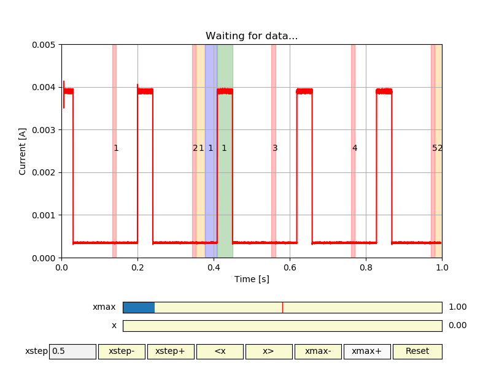

.. pydgilib documentation master file, created by
   sphinx-quickstart on Fri Feb 15 13:53:40 2019.
   You can adapt this file completely to your liking, but it should at least
   contain the root `toctree` directive.

Welcome to pydgilib's documentation!
====================================

.. toctree::
   :maxdepth: 5
   :caption: Contents:

.. include:: README.rst

Indices and tables
==================

* :ref:`genindex`
* :ref:`modindex`
* :ref:`search`

Code Coverage Report
====================

`Code Coverage Report <htmlcov/index.html>`_

Disclaimer
==========

Atmel® is a trademark of  Atmel Corporation, which is not affiliated with the makers of this product.
Atmel Studio and DGILib are products of Atmel Corporation.